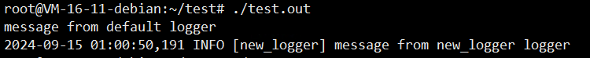
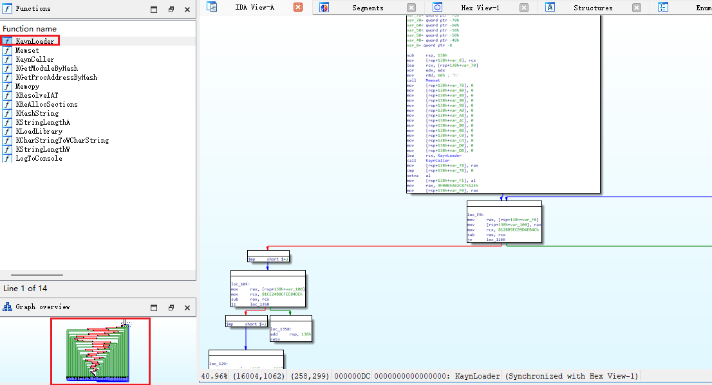

### Obfuscate your beacon 

#### Linux to Windows obfuscated cross toolchain environment configuration and precompiled packages

Useful for red teams (e.g. install on teamserver to obfuscate your beacon)


#### Install:

Pre-requisites:

(1) The following commands must be executed in the /root directory(Because the some scripts limits the directory to the root directory)

(2) ubuntu22.04 or later (This is just because the package I built was built on this system. If you want to use it on your system, you need to build it yourself.)


First (Config Native Env):

```
git clone --depth=1 https://github.com/llvm/llvm-project.git
cd llvm-project
mkdir build
cd build 
unzip ~/bin.zip
ln -s ~/llvm-project/build/bin/clang /usr/bin/clang
ln -s ~/llvm-project/build/bin/clang++ /usr/bin/clang++
ln -s /usr/bin/clang /usr/local/bin/clang
ln -s /usr/bin/clang++ /usr/local/bin/clang++
chmod a+x /usr/bin/clang++
chmod a+x /usr/bin/clang
clang++ main.cc easylogging++.cc -o test.out -I ~/llvm-project/clang/lib/Headers/
./test.out
```




Second (Config Cross Env):

```
cd ~
unzip llvm-mingw.zip
ln -s ~/llvm-mingw/bin/ld.lld /usr/bin/ld.lld
~/llvm-mingw/bin/x86_64-w64-mingw32-clang++ -static main.cpp -o /root/test.exe
```


**Here is an example of how to use it when target is Windows:**


https://github.com/HavocFramework/Havoc/blob/main/payloads/DllLdr/makefile

```
CCX64 = ~/llvm-mingw/bin/x86_64-w64-mingw32-clang
CCX86 = ~/llvm-mingw/bin/i686-w64-mingw32-clang

INCLUDE = -I Include -I ~/llvm-mingw/generic-w64-mingw32/include

# Options for regular build
OPTIONS = -w -Wall -Wextra -fPIC -fno-asynchronous-unwind-tables $(INCLUDE)

# Options for debug build
DEBUG_OPTIONS = -g -Wall -Wextra -fPIC -fno-asynchronous-unwind-tables -DDEBUG $(INCLUDE)

EXECUTABLE_X64 = DllLdr.x64.o
RAWBINARY_X64  = ../DllLdr.x64.bin

all: extract

# Regular x64 build
x64: clean
	@ echo "[*] Compile x64 object file..."
	@ $(CCX64) -c Source/Entry.c -o $(EXECUTABLE_X64) $(OPTIONS)

# Debug x64 build
x64-debug: clean
	@ echo "[*] Compile x64 object file with debugging information..."
	@ $(CCX64) -c Source/Entry.c -o $(EXECUTABLE_X64) $(DEBUG_OPTIONS)

extract: x64
	@ echo "[*] Extract shellcode: $(RAWBINARY_X64)"
	@ python3 Scripts/extract.py -f $(EXECUTABLE_X64) -o $(RAWBINARY_X64) || { echo "Extract failed"; exit 1; }

debug:x64-debug

# Clean up
clean:
	@ rm -rf Bin/*.o
	@ rm -rf Bin/*.bin

```





Credits:

https://github.com/HavocFramework/Havoc

https://github.com/mstorsjo/llvm-mingw